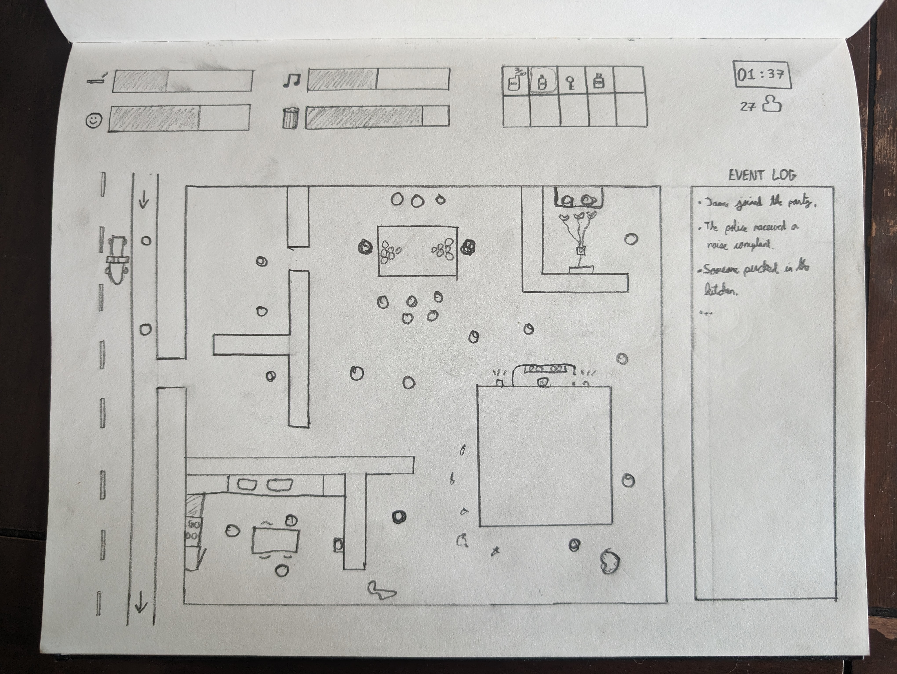
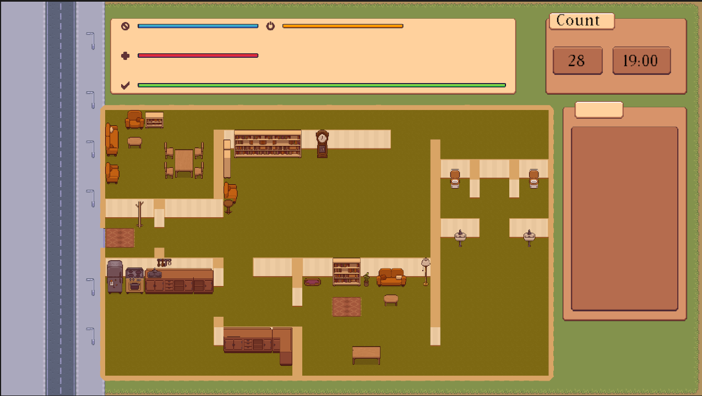

# Weekly Class Journal

## Week 5

## Shmup Game - Quack Attack: Citrus Siege

Designing the shmup was way harder then I imagined espically with only a week to create the game I needed something simple but different. I went with a Duck and decided to make the enemies Lemonade stand guys a reference to a classic childrens video growing up.

The process of making the game was pretty smooth except for two bugs that were quite diffult to fix:

The first bug was the players bullets destroying the player, the bug actually happened because there was a rogue ! in one of the if statements... Two hours of crying later...

The second bug was player to enemie collisions, this ended up being fixed after the first bug.

I don't consider this game finished as of yet, but I did learn a lot about Unity and C#. In the future I would have liked to add powers ups, and infinite mode and some sounds, but unfortuantely for someone who has never touched Unity before this was incredily difficult and took a lot of time just making the core aspects.

# Week 7 Final Game Prototyping

# Shindig Tycoon

**"Shindig Tycoon"** is an exhilarating single-player management simulation where you step into the shoes of the ultimate house party host. Your mission? To throw the most legendary parties in the heart of Partydale. As the mastermind behind these unforgettable gatherings, you're tasked with juggling a myriad of responsibilities to keep your guests ecstatic. From blasting the latest hits that keep the energy high, maintaining an impeccable environment, to mixing the wildest cocktails, every detail counts. Your objective is clear: create a buzz that makes your house the talk of the town while skillfully avoiding unwanted attention. Dodge the watchful eyes of your parents and steer clear of any reasons for the police to disrupt your epic celebration. Welcome to **"Shindig Tycoon,"** where the night is young, and the possibilities are endless.

## Game Features

### Art Direction / Sprites

- **Map**
- **Character**
- **Objects**

### Mood Manager

- **Interactions**
- **Map Boundaries**
- **Physics Interactions**
- **Object Interactions / Minigames**

### Character AI

- **AI Interactions with Minigames**
- **AI Movement**
- **Villain Interaction**
- **Police**
- **Neighbours**
- **Your Parents**

### Game Manager

- **HUD / UI**
- **The Meters:**
  - Happiness
  - Music
  - Trash
  - Drink
  - People Level
  - Time
  - Amount of People in the House
  - Event Log

Embark on a mission to have the most pumping house party in all of Partydale. Make sure to keep your parents away and not let the cops come knocking!

# Week 8 Starting the Interactive Prototype

We decided to remove the "RPG" Battle component since it would disrupt the overall flow of the game as well as we are on a time limit.

My role within the game is designing the HUD and GameManagement Systems. I'm to design how the meters work and how they effect the overall happiness as well as the Event Log, Player Count and Time.

We first started by designing the art to get it out of the way first, we went for a top-down pixel art to pay homage to pokemon.

# Week 9 Interative Prototype

This week I started working the Meter interactions I created a Meter class so each Meter follows the class blueprint to make it easier and not have a bunch of different meter scripts, the Happiness meter works a bit different since its calculated from all the other Meters so it has its own script. I ran into issues visually displaying the scripts, but I ended up using the UI panels to display them. I now have to connect all the pieces and make the scripts move with the values given to it.

Tasks still to do:

- Event Log
- Player Count
- Player Time
- End Screen
- Win screen
  
  

## Week 10 Journal Update

This Week I finished the Meter Interactions, they should now update visually and internally based on the value sent. There are Three Meters, Drink, Music, Trash each is attached to a visual meter and can be sent a value (- +) that changes it. These meters then fall into the Happiness Meter which calculates the overall satisfaction across all the meters. I also added a Time Text that has a changeable time value, so you can set how long it takes to go from 22:00-6:00, right now the value is set to 5 minutes but it needs further exploration to see. A People count was also sent up to manage how many People there are in the house party

Task still to do:

- Merge branches
- Event log
- Win Screen
- End Screen

## Week 11 Journal Update

Today we merged our branches, the game itself is starting to come to shape. We have both the gameplay and the HUD in the same scene. There was not too many issues merging and it was relatively easy. We had to fix a lot of the sprites so it would line up with each. I also added more furniture in and added a font to give the text a more retro vibe. As of now most of the visual components are in and the meters are hooked up. I now have to link my player count with the AI player count.

On Louis side he needs to make the character and the game mechanics, once these are done hooking everything up should be quite easy. We will aim to have one level start to finish done by the due date.

Task still to do:

- Player
- Event Log
- Win Screen
- End Screen
